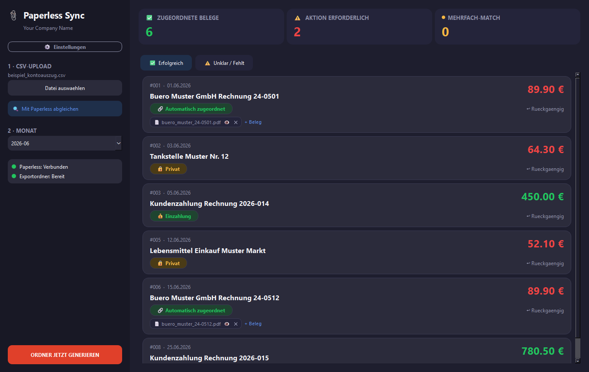
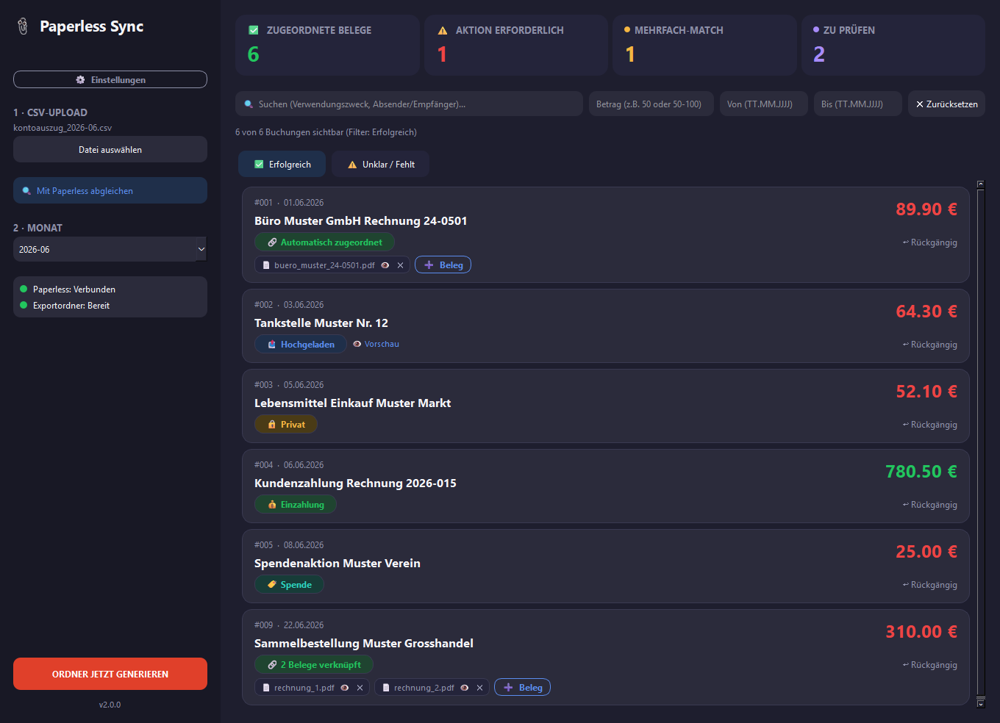

# Paperless Sync

A desktop tool that reconciles a bank statement CSV against documents stored in [Paperless-ngx](https://docs.paperless-ngx.com/), so every transaction ends up with a matching receipt — built for gap-free bookkeeping records for tax purposes (accountant-ready exports included).

  

Built and released for Windows; the underlying app (PySide6/Qt) runs cross-platform and macOS/Linux build paths exist, but they haven't been verified on real hardware yet — see [Installation](#installation) below.

## What it does

1. **Import** a bank statement CSV (any delimiter/encoding, auto-detected).
2. **Match** each transaction against your Paperless-ngx documents by amount — either parsed from the filename via a configurable regex (e.g. `_EUR12.34.pdf`) or read from a Paperless custom field.
3. **Resolve** what's left by hand: upload a PDF (drag & drop or file picker), pick an existing Paperless document, or tag the transaction (Private / Deposit / Transfer / your own custom tags) when no receipt is needed. Multiple documents can be linked to one transaction (e.g. a combined charge with several individual invoices).
4. **Export** a clean, numbered folder per month — matched PDFs, tag notes for untagged bookings, a filtered copy of the original CSV, a list of unresolved transactions, and a separate list of all "Deposit"-tagged bookings — ready to hand to an accountant.
5. **Bundle a whole fiscal year** into one folder with a single click — all 12 monthly folders plus a combined overview (CSV and PDF) and a dedicated summary of anything still unresolved, optionally zipped up.

The app learns as you go: once you tag a recurring transaction (e.g. a subscription with a varying reference number), it suggests the same tag next time a similar booking shows up.

## Features

- **Automatic CSV parsing** — encoding/delimiter/date/amount format detection, works with most European bank export formats.
- **Optional direct bank import** — fetch transactions straight from your bank via your own [Enable Banking](https://enablebanking.com/) application, guided by an in-app setup wizard — see [below](#optional-setting-up-bank-import-enable-banking). Every import (CSV or bank) is archived with a timestamp so you always have the original source data.
- **Two receipt-detection methods** — filename regex or a Paperless custom field holding the invoice amount.
- **Duplicate-booking detection** — two bookings with the same date, amount, and purpose are flagged for review instead of silently matching the same receipt to both.
- **Tolerant amount matching & split-payment detection** — optional (off by default until their candidate-selection UI is refined further): suggest receipts within a configurable amount tolerance, or a receipt/booking that's really the sum of several others.
- **Learned tag suggestions** — recurring bookings (same purpose text, ignoring dates/reference numbers) get a one-click tag suggestion.
- **Multi-document matching** — link several Paperless documents to a single transaction (e.g. a marketplace payout covering multiple invoices).
- **Yearly export** — bundle a full fiscal year (calendar year, or a custom fiscal year start month) into one folder: all 12 monthly exports, a combined overview CSV/PDF, and a dedicated open-items summary — see [below](#yearly-export).
- **Live search & filter** — filter the transaction list by text, amount (or range), and date range, combinable with the status tabs; a hint always shows how many bookings are currently visible.
- **Keyboard navigation** — arrow keys to move between transactions, Ctrl+Down to jump to the next unresolved one.
- **mTLS client certificate support** — for Paperless instances behind something like Cloudflare Access with a PKCS#12 client certificate.
- **Backup & restore** — one ZIP with settings, learned tags, credentials, and current work state; restorable on a new machine.
- **Custom company logo** — replace the default paperclip icon at the top of the sidebar with your own (PNG).
- **In-app PDF viewer** — preview linked or uploaded receipts without leaving the app.
- **German / English UI** — switchable in Settings (restart required).
- **Paperless success tag** — optionally tags matched documents back in Paperless itself, so the match status is visible/filterable there too.

## Screenshots



*Transactions needing review — multi-match, duplicate-suspect, and split-payment cases each get their own badge and suggested candidates.*



*Matched and tagged transactions — automatically matched, manually uploaded, or tagged as not needing a receipt.*

*(both shown with placeholder demo data — no real transactions)*

## Installation

### Windows (recommended)

Download the latest installer from the [Releases](../../releases) page and run it. `Paperless Sync` will appear in your Start menu.

> **Windows flags the installer as unrecognized ("Smart App Control" / SmartScreen blocked this app)?** This is expected for an app from an unverified (non-code-signed) publisher, not a sign of a bad download. Click **"More info" → "Run anyway"** in the SmartScreen prompt, or if Smart App Control has blocked it outright: right-click the downloaded `.exe` → **Properties** → check **"Unblock"** at the bottom → **OK**, then run it again.

### macOS

No packaged release yet — build and run from source (see below). Requires Python 3.12+ (`brew install python@3.12` if you don't have it). The `.app`-bundle build path (`build/desktop_app_qt_macos.spec`) exists but is untested on real hardware; without code signing, Gatekeeper will likely flag the built app as being from an unverified developer, similar to the Windows Smart App Control situation.

### Linux

No packaged release yet — build and run from source (see below). Requires Python 3.12+ and the usual Qt runtime libraries for your distro (most desktop environments already have these; if PySide6 fails to start, install your distro's `libxcb`/Qt platform plugin packages). The onefile build path (`build/desktop_app_qt_linux.spec`) exists but is untested on real hardware.

### From source (any platform)

Requires Python 3.12+.

```bash
git clone <this-repo-url>
cd paperless-sync
pip install -r requirements.txt
python run_app.py
```

On first launch you'll be guided through a short setup: your Paperless-ngx URL and API token, and how invoice amounts should be detected.

## Building the executable

```bash
pip install -r requirements-build.txt
python build/build.py
```

`build/build.py` detects the current platform and picks the matching PyInstaller spec automatically:

- **Windows**: `dist/PaperlessSyncQt/PaperlessSyncQt.exe`, and — if [Inno Setup](https://jrsoftware.org/isinfo.php) is installed — a Windows installer into `installer_output/`. This is the only path that's actually been built and run end-to-end.
- **macOS**: `dist/PaperlessSyncQt.app` — untested, see the macOS note above.
- **Linux**: `dist/PaperlessSyncQt` (single executable) — untested, see the Linux note above.

## Configuration

All settings are reachable from the "⚙️ Settings" button in the app — no manual file editing needed:

- **Paperless URL + API token** (and optional client certificate for mTLS-protected instances)
- **Export folder** — where finished monthly folders are written (e.g. a shared OneDrive/accountant folder)
- **Receipt amount detection** — filename regex or custom field
- **CSV column mapping** — which columns hold date/amount/purpose/sender
- **Custom tags, noise terms, backup/restore, language, company logo**

User data (config, session state, backups) lives in the platform-standard per-user app data location when running a built app — Windows: `%APPDATA%\PaperlessSync`, macOS: `~/Library/Application Support/PaperlessSync`, Linux: `~/.config/PaperlessSync` — and next to the source files when run from source. Credentials are stored separately — see [Privacy & Security](#privacy--security).

## Yearly export

Next to the monthly export, a full fiscal year can be bundled into one folder with a single click — the "JAHRESEXPORT" button in the sidebar.

- **Fiscal year setting** (Settings → "Geschäftsjahr"): defaults to the calendar year; switch to a custom fiscal year start month (e.g. July) if that matches your accounting instead.
- Clicking the button asks for the fiscal year's start year, then builds `Jahresexport_<year>` (or `Jahresexport_<year>-<year+1>` for a custom fiscal year) in the same export folder as the monthly export, containing:
  - All 12 monthly folders, freshly regenerated from the current data — regardless of whether any of them were already exported separately before.
  - `00_Jahresuebersicht.csv` — every transaction of the year in one table, with columns showing which month/folder each one belongs to.
  - `00_Offene_Posten_Jahr.csv` — only the still-unresolved transactions across the whole year, with a per-month/status summary count at the top.
  - `00_Jahresuebersicht.pdf` — a cover page, a summary page listing every open item first (color-coded by status, counted per month) before the full transaction list, and then the complete year grouped by month.
- If anything is still unresolved anywhere in the year, a warning shows how many and in which months before the export runs — same idea as the existing monthly-export warning, just year-wide.
- The finished folder can optionally be saved as a ZIP right after the export completes.

## Optional: Setting up bank import (Enable Banking)

As an alternative to uploading a bank statement CSV, transactions can be imported directly from your bank via [Enable Banking](https://enablebanking.com/), an open banking API provider. This is entirely optional — CSV import keeps working unchanged either way.

Every user registers and connects **their own** Enable Banking application — nothing is shared, and no credentials are bundled with the app. The easiest way to set this up is the in-app wizard: **Settings → Bank-Import (Enable Banking) → "Start setup wizard"**. It walks through all the steps below, including copy-to-clipboard values and a connection test with a preview of the fetched transactions.

The same steps, in case you want to follow along manually or the wizard gets stuck:

1. Sign in at [enablebanking.com/sign-in](https://enablebanking.com/sign-in) and go to "Applications" → "Add a new application".
2. Register it with **Environment: Production** and **Redirect URL: `https://redirectmeto.com/http://localhost:8765/callback`** (the app runs a local HTTP listener on that port during authorization; redirectmeto.com forwards the HTTPS redirect Enable Banking requires — even for localhost — to it, without needing your own certificate). Pick any application name you like.
3. A private key (`.pem` file) is downloaded automatically when the application is created. Move it to the folder the app shows you (default: the platform user-data location's `enable_banking/` subfolder, see above) — the wizard's "Open folder" button takes you straight there.
4. Enter the **Application ID** from the Enable Banking control panel into the wizard (or Settings) — it's saved to `config.json` immediately.
5. In the control panel, whitelist your own account for the application. "Restricted production" mode is meant for exactly this — personal use of an application only you access — and needs no separate contract for that.
6. Test the connection from the wizard; on success it shows a preview of the first few fetched transactions.

Once set up, a "Von Bank importieren" ("Import from bank") button appears in the sidebar. Clicking it asks for a date range — quick-select buttons cover the current month, last 30/90 days, or all available bookings, or enter a custom range by hand — then opens your bank's login in the browser. Depending on your bank, a fresh login may be required for every single import — many banks don't support the PSD2 exception for extended session validity, so this is expected, not a bug. Some banks also limit how far back transaction history can be fetched (often around 90 days) regardless of the date range you pick. Fetched transactions merge into your existing data (with the same duplicate protection as a repeated CSV import) rather than replacing it, and every import is archived into the `input/` folder for a paper trail.

## Privacy & Security

- **Everything runs locally.** Your bank statement CSV is parsed on your machine; matching happens directly against the Paperless-ngx instance you configure. There's no cloud service, no telemetry, no analytics — bank transaction data never leaves your device except to the Paperless-ngx server you point the app at (which you host/control), or — only if you opt into it — to your own Enable Banking application and your bank, for the direct bank import described above. The Enable Banking authorization code briefly passes through redirectmeto.com (a public HTTPS-redirect forwarding service) on its way back to a local listener on your machine; the code is worthless without your private key, which never leaves your device.
- **Credentials are never stored in plain text.** The Paperless API token and mTLS client certificate password are kept in your operating system's native credential store — Windows Credential Manager, macOS Keychain, or the Linux Secret Service (via the [keyring](https://pypi.org/project/keyring/) package). If no OS credential store is available (can happen on some minimal/headless Linux setups), the app falls back to passphrase-based encryption (AES via [Fernet](https://cryptography.io/en/latest/fernet/)) instead of ever silently falling back to plain text.
- **The working session is encrypted too.** `session_state.json` — the in-progress state that lets you close the app mid-reconciliation without losing work — contains transaction details and uploaded receipts, so it's encrypted at rest with the same key management as above.
- **Backups can be password-protected.** Since a backup includes your credentials (so it's actually useful after restoring on a new machine), the app prompts for a password when creating one and encrypts the ZIP with AES if you set one. Skipping the password triggers an explicit warning — it's never silently unencrypted without you choosing that.

## Architecture

Entry point: `run_app.py`. The UI (PySide6/Qt, `src/paperless_sync/ui_qt/`) is a thin layer over a framework-agnostic backend:

| Module | Responsibility |
|---|---|
| `src/paperless_sync/state/desktop_state.py` | Application state (replaces a web framework's session state) |
| `src/paperless_sync/state/desktop_controller.py` | User actions → state changes |
| `src/paperless_sync/core/matcher.py` | Building transactions from the CSV, matching against Paperless documents |
| `src/paperless_sync/core/paperless_client.py` | Thin Paperless-ngx REST API wrapper |
| `src/paperless_sync/core/exporter.py` | Generates the final per-month export folder |
| `src/paperless_sync/core/csv_utils.py` | Encoding/delimiter/amount/date parsing |
| `src/paperless_sync/core/config_manager.py` | `.env` / `config.json` loading and persistence |
| `src/paperless_sync/core/backup.py` | ZIP backup/restore of all user data |
| `src/paperless_sync/core/i18n.py` | Minimal DE/EN translation layer |

An older CustomTkinter UI (`legacy/desktop_app.py`) and an even older Streamlit web UI (`legacy/app.py`) are archived in `legacy/` (see `legacy/README.md`) and no longer actively maintained.

## Testing

The backend (CSV parsing, matching, export, backup/restore) is covered by an automated `pytest` suite:

```bash
pip install -r requirements-dev.txt
pytest
```

See [`tests/README.md`](tests/README.md) for what's covered and what's intentionally left out (Qt UI rendering and real network clients aren't part of this suite).

## License

MIT — see [LICENSE](LICENSE).
